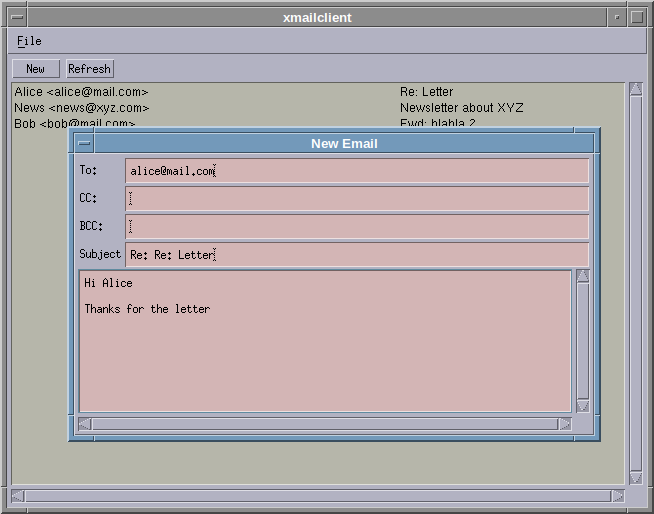

Mail client with retro design. In active development, currently able to display a list of mails in your main inbox.

# Getting started

You need the [openmotif](https://archlinux.org/packages/extra/x86_64/openmotif/) and [curl](https://archlinux.org/packages/core/x86_64/curl/) to compile this project (arch packages linked. Use -dev versions on debian)

rename `config.h.example` to `config.h` and fill in your server/username/password

# few random pointers and resources:

* CURL IMAP client example: [curl.se](https://curl.se/libcurl/c/imap-list.html)
* IMAP protocol example: [Wikipedia](https://en.wikipedia.org/wiki/Internet_Message_Access_Protocol#Dialog_example)
* Motif Table: [www.ist.co.uk](https://www.ist.co.uk/motif/books/vol6A/ch-24.fm.html#715693)

